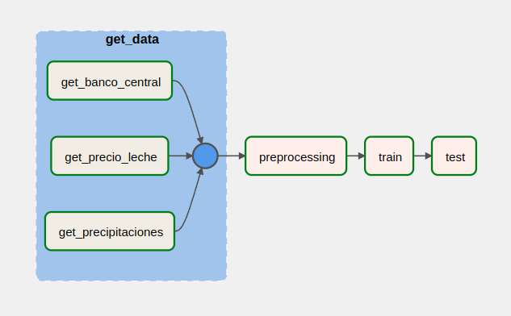
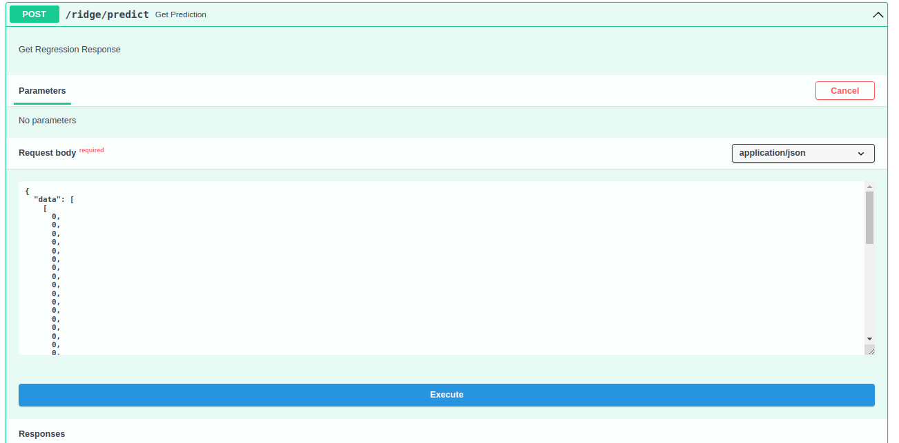

# MLOps Pipeline

This repository contains a training pipeline of a regression model and an API for deploying the model into production.
## Requirements

The only requirements to run both, the pipeline and the API, are ```docker``` and ```docker-compose```. In addition, to perform a load testing you should install locust:

```zh
pip3 install locust
```
## Overview

The model training pipeline was build using ```airflow```. Airflow is an open-source workflow management platform for data engineering pipelines. Airflow uses directed acyclic graphs (DAGs) to manage workflow orchestration. 

A containerised version of Airflow is used through docker-compose.

The API that can take incoming prediction requests was built using ```FastAPI```, a Web framework for developing RESTful APIs in Python. This API was also built using Docker containers.

## Previous setup

### Clone the repository

The first step is to clone the repository and entry to its root folder
```zh
git clone https://github.com/DanielMontecino/mlops-challenge
cd mlops-challenge
```

### Verify ports
FastApi uses port 80 to receive requests. Airflow uses ports 6379, 8080, and 5555, and locust uses port 8089. Therefore, the first step is to make sure that these ports are not in use.

Show all the used ports with the following command, and look for the mentioned ports.
```zh
ss -ntl
```
or look for each port with the following command (if there is no responde, ports are unused):
```zh
ss -ntl | grep 80
ss -ntl | grep 8080
ss -ntl | grep 6379
ss -ntl | grep 5555
ss -ntl | grep 8089
```

## Training Pipeline

To run the pipeline, the first step is to run airflow.

### Initialize Airflow

To create necessary folders and initialize airflow, just run:

```zh
bash init.sh
```

If you are curious, this shell script creates some folders, sets an airflow environment variable, initializes airflow, and runs it.
```zh
#!/bin/bash

mkdir -p ./pipeline/logs ./pipeline/plugins ./data/raw_data ./data/processed_data ./models
echo -e "AIRFLOW_UID=$(id -u)" > ./pipeline/.env

cd pipeline
docker build -t airflow-custom .
docker-compose up airflow-init
docker-compose up
```
Wait until the page [http://localhost:8080/home](http://localhost:8080/home) runs correctly. 
To enter the airflow page, use the credentials:

```
user: airflow
pass: airflow
```

Once inside, go to the ml_pipeline marked in the red box below.


### The pipeline

The pipeline is shown below



First, data extraction is performed. A module was created to extract data (get_data) and contains three sub-modules. These sub-modules are executed in parallel, one for each of the sets (precipitaciones, banco_central, and precio_leche).
If the data extraction is successful, the processing module is triggered. Here, the three sets are processed, and the train and test datasets are generated.

The model is then trained using the training data and serialized in the ```models``` folder in .pk and .joblib format.

Finally, the model is tested using the test dataset. The evaluation generates RMSE and R2 metrics, although any other metric could be
included. In a CI/CD pipeline, at this stage, it should be evaluated whether the model meets the requirements to put into production. If it is the case, trigger the model deployment. In this project, this step will be done manually.

In addition to the logs generated by airflow in the ```pipeline/logs folder``` (```dag_processor_manager```, ```ml_pipeline``` and ```scheduler```), the
```pipeline/logs/pipeline_logs``` file is created, where custom pipeline logs are saved.

### Run Pipeline

To run the pipeline, press the play button marked in a red box in the following image.


If the run success, you should see green squares next to each module.

To verify that the process was correctly run, we could see if the data was downloaded correctly (it wasn't included in the original repo) and that the model was correctly saved.

```zh
ls data/raw_data
ls data/processed_data
ls models
```

And, of course, we can check the test metric in the logs.

```zh
cat pipeline/logs/pipeline_logs
```

## Model Deployment

### Initialize App
The only step to put the model into production is to run the ```init_app.sh``` script:

```zh
bash init_app.sh
```
This script builds the Docker image of the app and starts a container with it.

The container uses the volumes ```models``` and ```app/logs``` to load the model and write logs, respectively.
```zh
#!/bin/bash

docker build -t ridge-api app/
docker run -d -p 80:80 -v $PWD/models:/app/models -v $PWD/app/logs:/app/logs --name ridge-api-container ridge-api
```

### API Predictions
Then, an API is hosted locally, where prediction should be requested to ```http://127.0.0.1/ridge/predict```. 
There are two ways of testing the prediction of the model. The first is requesting through the command line:

```zh
curl -X 'POST' \
  'http://127.0.0.1/ridge/predict' \
  -H 'accept: application/json' \
  -H 'Content-Type: application/json' \
  -d '{
  "data": [
    [0,0,0,0,0,0,0,0,0,0,0,0,0,0,0,0,0,0,0,0,0,0,0,0,0,0,0,0,0,0,0,0,0,0,0,0,0,0,0,0,0,0,0,0,0,0,0,0]
  ]
}'
```

The other is by the GUI of FastAPI: [http://127.0.0.1/docs](http://127.0.0.1/docs). Select the method ```ridge/predict```


Select "Try it out"


Then, you can change the data to perform the prediction test, and then press ```Execute```



The results will be shown below:


### Model Check

An additional method was made in ```http://127.0.0.1/ridge/check``` to test the model and check if it is still working as it should.When calling this method, random data is generated, is passed to the model, and the model perform a prediction over the data.
The data and the prediction are sent as a response.

Requests to this method can be made by:
```zh
curl -X 'POST' \
  'http://127.0.0.1/ridge/check' \
  -H 'accept: application/json' \
  -d ''
```

Or by the FastAPI GUI, similar to the previous example:


## Load Testing

Optionally, you can perform a load test over the API.

To do that, just run the command:
```zh
locust -f ./test/load_test.py
```
This will bring up a web application at [http://0.0.0.0:8089](http://0.0.0.0:8089).

Upon entering, you access the Locust GUI, where you must enter the maximum concurrency of the test, and the number of users per second.
For example, we are going to test with a concurrency of 500 and 50 users per second.


Upon entering, you access the Locust GUI, where you must enter the maximum concurrency of users and the number of users per second.
For example, we are going to test with a concurrency of 500 and 50 users per second.
Then press "Start swarming" to start the test. Results will be shown next.


Where 11340 request were done with 4 requests failed (~0%), and the average response time was 10 ms.

